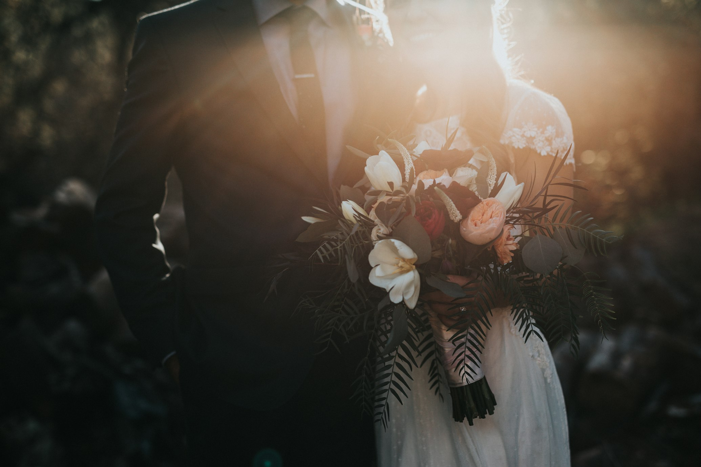

# Convite Digital de Casamento — Template

Este é um projeto **real** de Convite Digital de Casamento, originalmente desenvolvido para um evento real. Para fins de exibição em portfólio, o projeto foi transformado em um modelo genérico (sanitizado), onde todos os dados sensíveis foram modificados ou removidos para garantir a **segurança e integridade das informações originais**, mantendo apenas a excelência técnica e visual.



## Destaques do Projeto

*   **Design Editorial de Luxo:** Tipografia refinada (*Playfair Display* e *Inter*), uso de versaletes, espaçamentos generosos e ornamentos clássicos.
*   **Seção de Presentes Premium:** Layout assimétrico inspirado em revistas de moda, com máscaras de imagem em arco e botões de ação elegantes.
*   **Experiência Imersiva:** Audio Player customizado que aguarda a interação do usuário para iniciar a trilha sonora, respeitando as políticas do navegador.
*   **Módulos Interativos:**
    *   Contagem regressiva dinâmica para o grande dia.
    *   Integração com Google Maps e Adicionar à Agenda.
    *   Galeria de fotos com revelação suave (*Scroll Reveal*).

## Tecnologias Utilizadas

*   **Framework:** [Next.js 15](https://nextjs.org/) (App Router)
*   **Linguagem:** [TypeScript](https://www.typescriptlang.org/)
*   **Estilização:** Vanilla CSS (Foco em performance e controle total do design)
*   **Ícones:** [Lucide React](https://lucide.dev/)
*   **Animações:** Implementação customizada de Scroll Reveal
*   **Imagens:** Sourced from Unsplash (Domínio Público)

## Como Executar

1.  **Clonar o repositório:**
    ```bash
    git clone https://github.com/seu-usuario/convite-digital-casamento.git
    ```

2.  **Instalar dependências:**
    ```bash
    npm install
    ```

3.  **Iniciar o servidor de desenvolvimento:**
    ```bash
    npm run dev
    ```

4.  **Visualizar:**
    Abra [http://localhost:3000](http://localhost:3000) no seu navegador.

## Privacidade e Segurança dos Dados

Este projeto é fruto de uma aplicação real, porém todos os dados originais foram modificados a fim de manter a integridade e segurança das informações reais. O projeto foi 100% sanitizado para exibição pública, tendo sido removidos:
*   Nomes reais dos noivos, familiares e padrinhos.
*   Chaves de PIX e informações financeiras.
*   Endereços exatos e links de localização real.
*   Fotos pessoais (substituídas por stock photos de alta resolução).

---

Desenvolvido por [Laura Serbêto](https://www.linkedin.com/in/lauraserbeto/)
